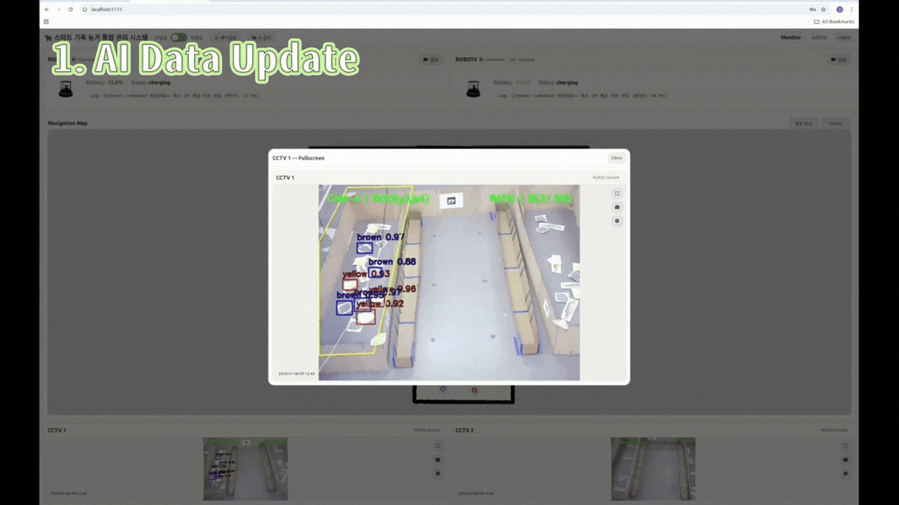
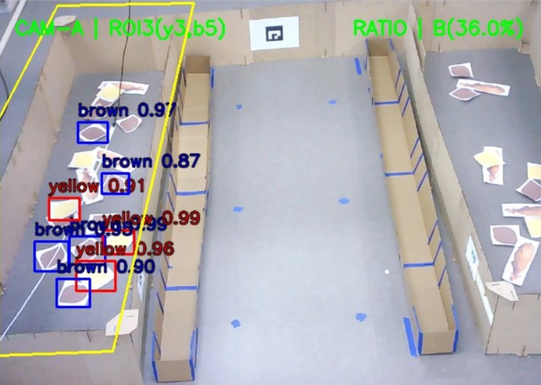
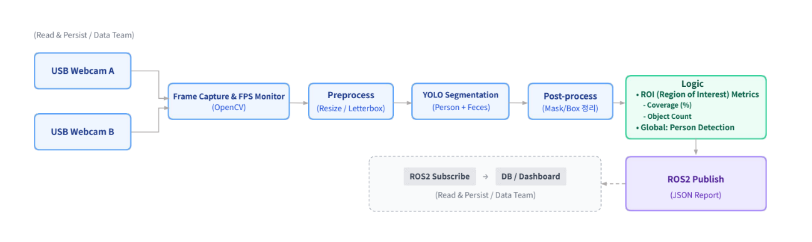
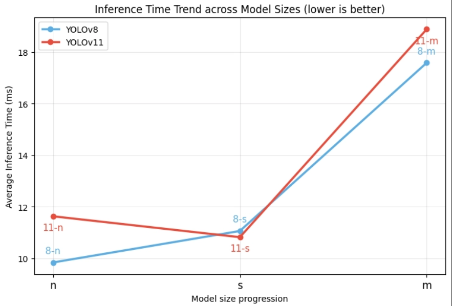
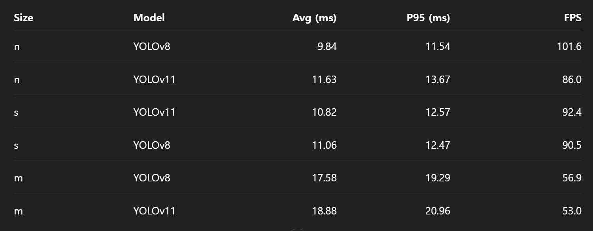

# Smart Farm ROI Segmentation (ROS2)

Dual CCTV 입력을 YOLO Segmentation으로 분석하고, ROI(우방) 단위 오염도 지표와 사람 감지 여부를 JSON 리포트로 ROS2 토픽에 발행하는 노드입니다.

## Demo / Screenshots



> Note: 하드웨어(Dual CCTV) 및 모델 weights가 필요하며, 본 레포는 로직/파이프라인 공유 목적입니다.

## What I did
- Dual Camera 추론 파이프라인 설계 및 ROI(우방) 단위 지표화 로직 구현
- ROI 기반 관심영역 제한 + blocked ROI 제외로 불필요 영역 오탐 감소
- ROS2 JSON 리포트 발행 구조 설계(대시보드/저장 연동 고려)

## Pipeline (Flow)


## Key Logic
- Dual Camera 입력을 처리하고, Cam별 ROI polygon 내부(center point)만 카운트 집계
- ROI1/ROI4는 blocked ROI로 제외, ROI2/ROI3만 모니터링 지표로 사용
- `manure_coverage_percent`: `min(100, 4.5 * (yellow_count + brown_count))`
- `feces_count`: `yellow_count`만 발행(현장 모니터링용 카운트)
- 사람(person) 감지 여부를 별도 플래그로 포함

## Model Selection (Inference)
실시간 운영을 위해 YOLOv8 / YOLOv11의 n/s/m 모델을 추론 지표(avg/p95/FPS)로 비교했습니다.




**결론:** 실시간 운영 기준으로 n-scale이 가장 유리하여 최종 운영 모델을 선정했습니다.

## ROS2 I/O
- Pub Topic: `/cow/roi_contamination` (std_msgs/String)

### Payload(JSON) Example
```json
{
  "type": "report",
  "stable_id": "우방2",
  "manure_coverage_percent": 31.5,
  "feces_count": 4,
  "human_detected": 1,
  "measured_at": "2025-01-02T18:04:12"
}
```

- `stable_id`: ROI 단위 식별자(예: 우방2/우방3)  
- `manure_coverage_percent`: 오염도 점수(0~100, cap 적용)  
- `feces_count`: `yellow_count`  
- `human_detected`: 1/0  
- `measured_at`: timestamp  

## Parameters (tunable)
- `model_path`: `weights/best.pt` (weights 파일은 레포에 포함하지 않음)  
- `conf`, `imgsz`  
- `camera_a`, `camera_b`  
- ROI polygons: `roi*_poly` (각 ROI는 (x,y) 점 리스트)  

## Run (hardware required)
- Dual USB CCTV + YOLO weights 필요  
- ROI polygon 좌표는 촬영 세팅/설치 위치에 따라 조정 필요  
